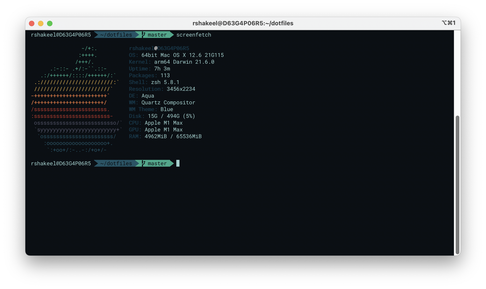
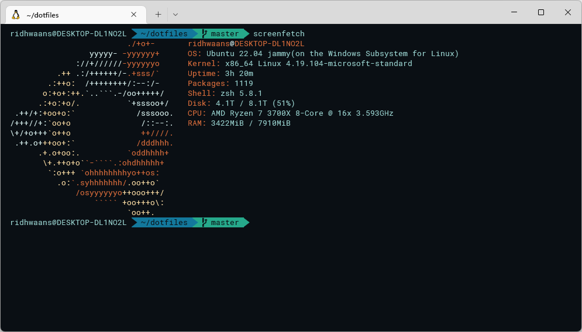

# dotfiles
 https://github.com/ridhwaans/dotfiles




## quick start
clone this repository
```
git clone https://github.com/ridhwaans/dotfiles.git ~/dotfiles
```

## manual installation
**Warning: Please back up your files before running setup**  
macOS
- **GET** [Ventura Update](https://support.apple.com/macos/upgrade)  
- **GET** Xcode Command Line Tools `xcode-select --install`

windows
- **GET** [Windows Subsystem for Linux (WSL2)](https://learn.microsoft.com/en-us/windows/wsl/install#update-to-wsl-2)  
- **GET** `Ubuntu 22.04 LTS (Jammy Jellyfish)` from the Microsoft Store
    - optional: upgrade to the interim release
    - [managing multiple linux distributions](https://learn.microsoft.com/en-us/windows/wsl/wsl-config#managing-multiple-linux-distributions)   

curl
```
bash -c "`curl -fsSL https://raw.github.com/ridhwaans/dotfiles/master/setup.sh`"
```
or, wget
```
bash -c "`wget -O - --no-check-certificate https://raw.githubusercontent.com/ridhwaans/dotfiles/master/setup.sh`"
```

## as a docker workspace
- **GET** [Docker Desktop](https://www.docker.com/products/docker-desktop/)  
- **GET** [VS Code Dev Containers extension](https://marketplace.visualstudio.com/items?itemName=ms-vscode-remote.remote-containers)  

in VS Code, select `Remote-Containers: Reopen in Container`, or  
`Remote-Containers: Rebuild Without Cache and Reopen in Container`, or  

#### manual build
build and run a detached instance
```
docker build . -t name:tag --progress=plain --no-cache
docker run -d -i -t name:tag
```
in VS Code, select `Remote-Containers: Attach to Running Container...`  
